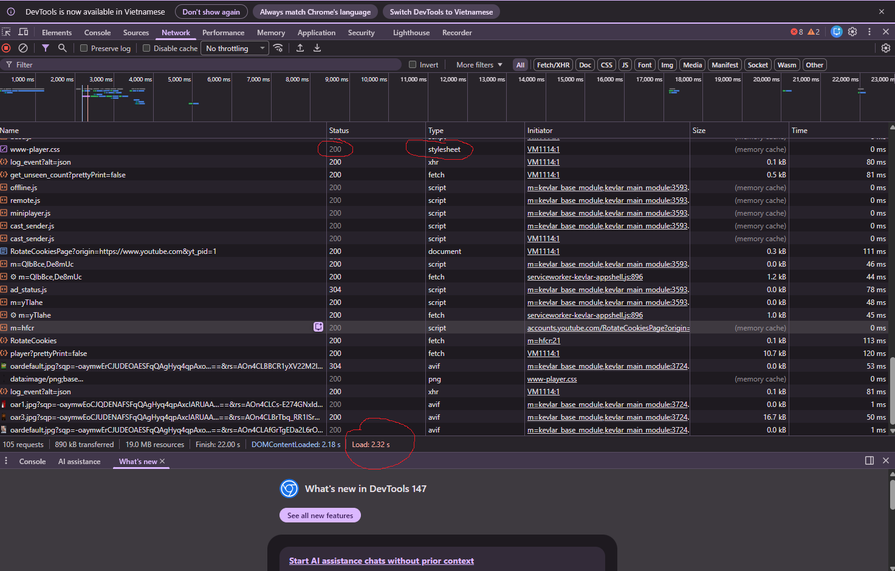
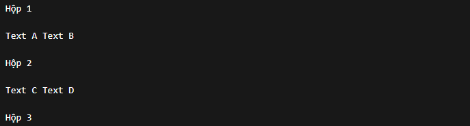
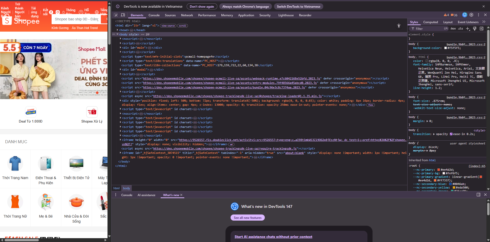
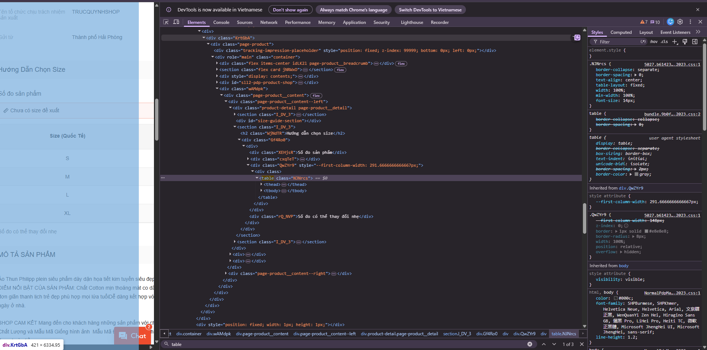
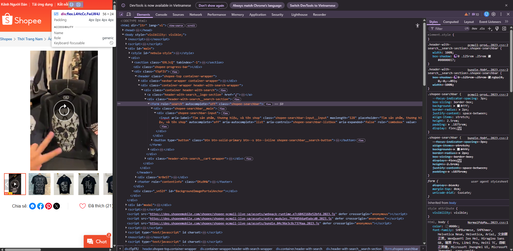

PHẦN A - KIỂM TRA ĐỌC HIỂU (20 ĐIỂM)

Câu A1 - HTTP & Browser
### Các bước khi truy cập https://shopee.vn:

1. Trình duyệt thực hiện DNS lookup để tìm địa chỉ IP của shopee.vn  
2. DNS server trả về địa chỉ IP tương ứng  
3. Trình duyệt thiết lập kết nối TCP với server (3-way handshake)  
4. Trình duyệt gửi HTTP request (GET) đến server  
5. Server xử lý và trả về HTTP response (HTML)  
6. Trình duyệt parse HTML → tạo DOM  
7. Tải thêm CSS, JS → tạo CSSOM  
8. Kết hợp DOM + CSSOM → render trang web 

### DevTools Network:

    

Tab Network hiển thị:

- Danh sách tất cả request (HTML, CSS, JS, ảnh…)
- Status Code (200, 404…)
- Thời gian tải (load time)
- Kích thước file
- Loại tài nguyên (document, css, js…)

Câu A2 - Semantic HTML

    Lỗi semantic (ít nhất 4):
1.Dùng 
 thay vì <header>
2.Menu không dùng <nav>
3.Sản phẩm không dùng <article>
4.Tiêu đề không dùng <h1> / <h2>
5.Ảnh không có alt
6.Không có cấu trúc <main>, <section>, <footer> đúng nghĩa

code sửa:
        <header>
            <h1>ShopTLU</h1>
            <nav>
                <a href="/">Trang chủ</a>
                <a href="/products">Sản phẩm</a>
            </nav>
        </header>

        <main>
            <section>
                <article>
                    <h2>iPhone 16 Pro</h2>
                    
25.990.000đ

                    <figure>
                        
                    </figure>
                </article>
            </section>
        </main>

        <footer>
            
© 2026 ShopTLU

        </footer>

Câu A3 - Block vs Inline
    
Giải thích:
    
 là block → chiếm toàn bộ dòng → xuống dòng
     và <strong> là inline → nằm cùng dòng
Nên:
    Text A + Text B cùng dòng
    Text C + Text D cùng dòng

Câu A4 - Table

Sự khác nhau:

<thead>: Nhóm các hàng chứa tiêu đề của cột/bảng.

<tbody>: Nhóm các hàng chứa dữ liệu chính của bảng.

<tfoot>: Nhóm các hàng chứa thông tin tổng kết, kết luận ở cuối bảng.

3 Lý do KHÔNG NÊN dùng table để tạo layout:

- Semantic sai: Table sinh ra để trình bày dữ liệu dạng bảng (tabular data), không phải để dàn bố cục. Dùng sai mục đích làm giảm điểm SEO và gây khó khăn cho các công cụ hỗ trợ đọc (Screen Readers).

- Khó khăn cho Responsive: Table rất cứng nhắc, rất khó để thiết kế giao diện thích ứng (responsive) trên các màn hình nhỏ như điện thoại.

- Tăng độ phức tạp của code (Code bloat): Code HTML sẽ trở nên cực kỳ phức tạp, lồng nhau nhiều lớp (<tr>, <td>), khó đọc và khó bảo trì so với việc dùng CSS Flexbox hoặc Grid.

PHẦN B — THỰC HÀNH CODE 
    B3 - Debug HTML

Lỗi 1: Dòng 1 — Thiếu chữ html trong khai báo DOCTYPE — Cách sửa: < !DOCTYPE html >

Lỗi 2: Dòng 2 — Thẻ <title> chưa đóng — Cách sửa: <title>Trang web</title>

Lỗi 3: Dòng 3 — Thuộc tính charset sai chuẩn — Cách sửa: <meta charset="utf-8">

Lỗi 4: Dòng 5 — Thẻ <h1> đóng sai bằng thẻ mở — Cách sửa: <h1>Welcome to ShopTLU</h1>

Lỗi 5: Dòng 9 — Thẻ <a> của "Trang chủ" đóng sai bằng thẻ mở — Cách sửa: <a href="home">Trang chủ</a>

Lỗi 6: Dòng 16 — Thẻ  thiếu dấu ngoặc kép cho giá trị thuộc tính và thiếu alt — Cách sửa: 

Lỗi 7: Dòng 18 — Cú pháp lồng thẻ sai (Nesting error) giữa <b> và 
 — Cách sửa: 
Giá: <b>25.990.000đ</b>

Lỗi 8: Dòng 23 — Bảng thiếu cấu trúc semantic, các thẻ tiêu đề bảng nên là <th> chứ không phải <td> — Cách sửa: Đổi <td>Tên</td> và <td>Giá</td> thành <th>Tên</th> và <th>Giá</th>, bọc trong <thead>.

Lỗi 9: Dòng 32 — Trang web có 2 thẻ <main> (một trang chỉ nên có duy nhất 1 thẻ main) — Cách sửa: Đổi <main> thứ hai thành <aside>.

Lỗi 10: Dòng 37 — Thẻ 
 trong footer chưa được đóng — Cách sửa: 
Copyright 2026

B4 - Phân tích trang web thật
        Trang web được chọn: shopee.vn
1.

3 thẻ semantic HTML5:

1. <header> — nằm ở phần đầu trang, chứa logo và thanh tìm kiếm
2. <nav> — chứa menu điều hướng danh mục sản phẩm
3. <footer> — nằm cuối trang, chứa thông tin liên hệ và chính sách

2 thẻ chưa dùng đúng semantic:

1. 
 — dùng div thay vì <main> cho nội dung chính
2. 
 — dùng div cho popup thay vì cấu trúc semantic như <dialog>

2.

* **Table đó hiển thị nội dung gì?** 
    Table này hiển thị bảng **Số đo sản phẩm / Hướng dẫn chọn size** (chứa các kích cỡ như S, M, L, XL... của mặt hàng thời trang).

* **Có dùng `<thead>`, `<tbody>` không?** 
    Dựa vào source code đã inspect, trang web **CÓ** sử dụng đầy đủ cả hai thẻ `<thead>` (chứa tiêu đề cột như "Size (Quốc Tế)") và `<tbody>` (bọc các hàng dữ liệu chứa thông số size tương ứng).

3.

* **Form đó có action và method gì?** 
    - action: không được khai báo → mặc định gửi về chính trang hiện tại
    - method: không khai báo → mặc định là GET

* **Input types nào được dùng?**
    - text (ô nhập nội dung tìm kiếm)
    - button (nút tìm kiếm)

PHẦN C — SUY LUẬN 

Câu C1 - Thiết kế cấu trúc
    [text](<CÂU C1.html>)

Câu C2 — So sánh & Tranh luận
    Quan điểm chỉ dùng 
 kết hợp class là sai lầm vì nó tạo thêm "nợ kỹ thuật". Semantic HTML là tiêu chuẩn bắt buộc trong Web hiện đại vì hai lý do kỹ thuật cốt lõi:

    Thứ nhất, về SEO. Crawler của Google không hiểu ý nghĩa các class CSS tự đặt (như 
). Việc dùng đúng thẻ ngữ nghĩa (như <article>, <main>) trực tiếp chỉ dẫn cho bot biết đâu là nội dung trọng tâm, giúp lập chỉ mục chính xác và tối ưu thứ hạng tìm kiếm.

    Thứ hai, về Accessibility (Khả năng tiếp cận). Trình đọc màn hình cho người khiếm thị phụ thuộc hoàn toàn vào thẻ HTML để điều hướng. Nếu dùng 
, máy sẽ đọc như văn bản trơ, nhưng với thẻ <nav>, thiết bị sẽ thông báo đây là vùng điều hướng để người dùng thao tác.

    Ví dụ cụ thể chứng minh: Khi tạo nút bấm bằng thẻ <button>, trình duyệt tự động hỗ trợ phím Tab để focus và Enter để click. Nếu dùng 
, bạn sẽ tốn thêm thời gian viết JavaScript và ARIA attributes để làm điều tương tự.

    Tuy nhiên, trường hợp thực tế 
 vẫn phù hợp là khi bạn chỉ cần một thẻ bao bọc (wrapper) vô nghĩa thuần túy để dàn bố cục bằng CSS (ví dụ: tạo Flexbox container để căn giữa các phần tử) mà không làm ảnh hưởng đến cấu trúc ngữ nghĩa tổng thể.