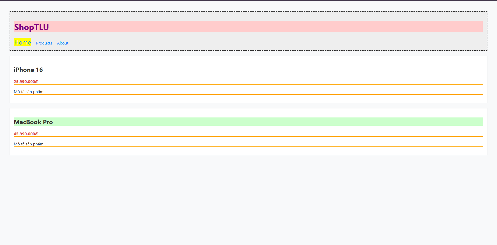

# PHIẾU BÀI TẬP 03
## PHẦN A - KIỂM TRA ĐỌC HIỂU
### Câu A1 (5đ) — 3 Cách nhúng CSS
1. Inline CSS (Nhúng trực tiếp vào thẻ HTML)

Code: `
Văn bản
`

Ưu điểm: Nhanh, ghi đè được các CSS khác (độ ưu tiên cao).

Nhược điểm: Khó bảo trì, code HTML bị rối, không tái sử dụng được.

Khi nào dùng: Dùng khi test nhanh một thuộc tính, hoặc được gen ra bằng JavaScript.

2. Internal CSS (Nhúng trong thẻ ``

Ưu điểm: Gom CSS vào một chỗ, dễ nhìn hơn Inline. Áp dụng cho toàn bộ file HTML đó.

Nhược điểm: Không tái sử dụng được cho các trang HTML khác. File HTML bị dài.

Khi nào dùng: Phù hợp làm các trang web đơn giản chỉ có 1 trang (Landing page nhỏ), hoặc viết template email.

3. External CSS (File `.css` riêng)

Code: `<link rel="stylesheet" href="style.css">`

Ưu điểm: Tách biệt HTML và CSS, tái sử dụng cho nhiều trang, trình duyệt có thể cache file CSS giúp tải trang nhanh hơn.

Nhược điểm: Phải tải thêm 1 file HTTP request (không đáng kể với web hiện đại).

Khi nào dùng: Luôn luôn dùng trong các dự án thực tế.

Câu hỏi thêm: Nếu 1 element có cả 3 cách áp dụng, Inline CSS sẽ "thắng". Theo quy tắc Cascade (thác nước) và Specificity (độ đặc hiệu), style viết trực tiếp vào thẻ HTML luôn có điểm ưu tiên cao nhất (bỏ qua trường hợp dùng `!important`).

### Câu A2 (8đ) — CSS Selectors — Dự đoán kết quả
1. `h1` → Chọn: ShopTLU và iPhone 16 và MacBook Pro (chú ý: nó chọn tất cả thẻ h1, nhưng trong HTML bài ra chỉ có "ShopTLU" là h1, các cái kia là h2. Nên đáp án đúng là: ShopTLU).

2. `.price` → Chọn: 25.990.000đ và 45.990.000đ

3. `#app header` → Chọn: Toàn bộ khối `<header>` chứa chữ ShopTLU và thanh menu nav.

4. `nav a:first-child` → Chọn: Home

5. `.product.featured h2` → Chọn: MacBook Pro

6. `article > p` → Chọn: Các đoạn text "25.990.000đ", "Mô tả sản phẩm...", "45.990.000đ", "Mô tả sản phẩm..."

7. `a[href="/"]` → Chọn: Home

8. `.top-bar.dark h1` → Chọn: ShopTLU

9. Screenshot: 

### Câu A3 (7đ) — Box Model — Tính toán kích thước
#### Trường hợp 1: content-box (Mặc định)

Chiều rộng hiển thị = 450px (Tính bằng: 400px width + 40px padding + 10px border)

Không gian chiếm trên trang = 470px (Tính bằng: 450px chiều rộng hiển thị + 20px margin)

#### Trường hợp 2: border-box

Chiều rộng hiển thị = 400px (Khi dùng border-box, padding và border sẽ ăn lẹm vào trong, tổng chiều rộng bị khóa cứng bằng đúng width).

Kích thước content thực tế = 350px (Tính bằng: 400px - 40px padding - 10px border)

Không gian chiếm trên trang = 420px (Tính bằng: 400px chiều rộng hiển thị + 20px margin)

#### Trường hợp 3: Margin collapse (Sụp lề)

Khoảng cách giữa box-a và box-b = 40px

Giải thích tại sao KHÔNG PHẢI 65px: Do hiện tượng Margin Collapse trong CSS. Khi 2 block xếp chồng lên nhau theo chiều dọc, margin-bottom của khối trên và margin-top của khối dưới sẽ không được cộng dồn. Thay vào đó, trình duyệt sẽ lấy giá trị lớn hơn giữa 2 giá trị đó (Max của 25 và 40 là 40).

Nâng cao: Nếu box-a có margin-bottom: -10px và box-b có margin-top: 40px, khoảng cách sẽ là 30px (Vì khi có margin âm, CSS sẽ tính bằng phép tổng đại số: 40 + (-10) = 30).

### Câu A4 (5đ) — Specificity (Độ ưu tiên)
#### 1. Tính specificity score (a, b, c) cho mỗi rule:

Rule A: p → Có 1 Element → (0, 0, 1)

Rule B: .price → Có 1 Class → (0, 1, 0)

Rule C: #main-price → Có 1 ID → (1, 0, 0)

Rule D: p.price → Có 1 Class, 1 Element → (0, 1, 1)

#### 2. Element sẽ có màu gì? Giải thích:

Element sẽ có màu Đỏ (red).

Giải thích: Trong 4 rule trên, Rule C sử dụng ID selector #main-price có điểm Specificity cao nhất là (1,0,0). Nó sẽ "thắng" tất cả các rule còn lại.

#### 3. Nếu thêm 
:

Element sẽ có màu Cam (orange).

Giải thích: Inline style (style viết trực tiếp trong thẻ HTML) có độ ưu tiên cao hơn ID Selector. Điểm của nó tương đương (1,0,0,0).

#### 4. Nếu Rule A thêm !important:

Element sẽ có màu Đen (black).

Giải thích: Từ khóa !important phá vỡ mọi quy tắc ưu tiên thông thường của CSS. Nó có quyền lực tuyệt đối và sẽ ghi đè lên cả ID Selector lẫn Inline Style.

## PHẦN B — THỰC HÀNH CODE (55 điểm)
### Bài B1 (20đ) — Style trang Profile
[text](profile.html)

### Bài B2 (20đ) — Box Model Lab
#### PHAN 1 - CONTENT BOX VS BORDER BOX

##### Ket qua do bang DevTools

- Hop 1 (content-box):
  Chieu rong thuc te = 350px

PBT_03/screenshots/Screenshot 2026-05-16 220314.png

- Hop 2 (border-box):
  Chieu rong thuc te = 300px

PBT_03/screenshots/Screenshot 2026-05-16 220457.png

##### Giai thich su khac biet

Voi content-box:
- Width chi tinh phan content.
- Padding va border duoc cong them vao tong kich thuoc.

Voi border-box:
- Width bao gom content + padding + border.
- Tong kich thuoc van giu nguyen 300px.

---

#### PHAN 2 - LAYOUT 3 COT

##### Truong hop KHONG dung border-box

Tong kich thuoc cua 3 cot lon hon 1000px nen layout bi tran.

PBT_03/screenshots/Screenshot 2026-05-16 220651.png

##### Truong hop CO dung border-box

Tong kich thuoc van giu dung 1000px nen layout hien thi gon gang.

PBT_03/screenshots/Screenshot 2026-05-16 220834.png

### Bài B3 (15đ) — Specificity Battle
#### 10 CSS Rules va Specificity

1. p
   Specificity: 0,0,1

2. .text
   Specificity: 0,1,0

3. .highlight
   Specificity: 0,1,0

4. p.text
   Specificity: 0,1,1

5. p.highlight
   Specificity: 0,1,1

6. .text.highlight
   Specificity: 0,2,0

7. p.text.highlight
   Specificity: 0,2,1

8. #demo
   Specificity: 1,0,0

9. #demo.text
   Specificity: 1,1,0

10. #demo.text.highlight
    Specificity: 1,2,0

---

#### Ket qua cuoi cung

Element "Hello World" hien thi mau den (black).

Ly do:
Rule #demo.text.highlight co specificity cao nhat
(1,2,0) nen duoc uu tien ap dung.

---

#### Neu thay doi thu tu CSS rules thi sao?

Neu specificity khac nhau:
- Ket qua KHONG doi.
- Rule co specificity cao hon van duoc uu tien.

Neu specificity bang nhau:
- Rule viet sau se duoc uu tien.