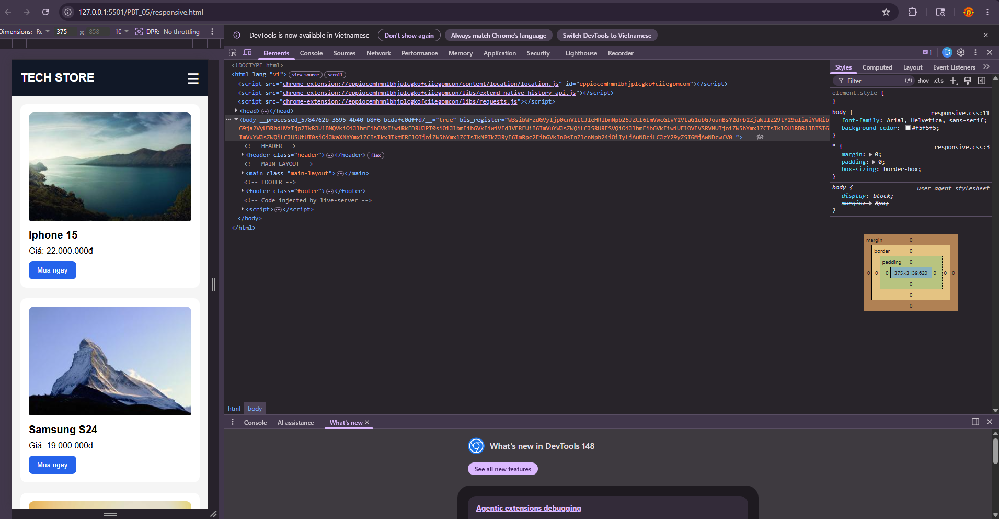
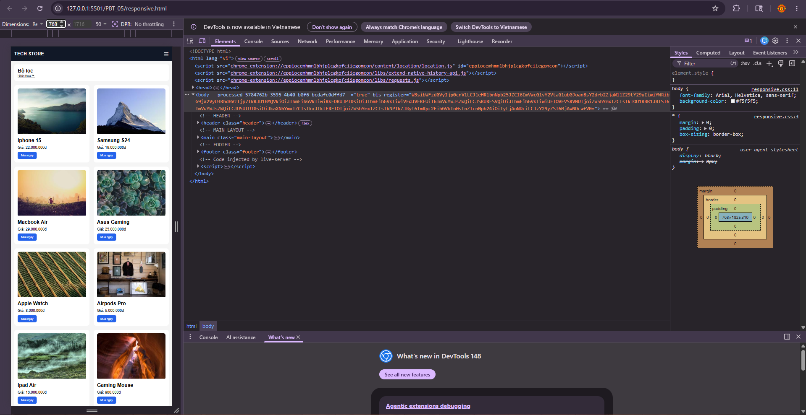
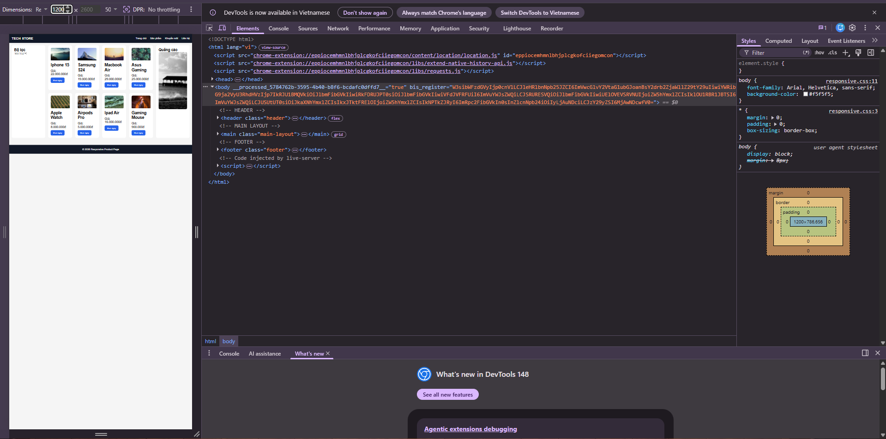

# PHẦN A — KIỂM TRA ĐỌC HIỂU

---

# Câu A1 (5đ) — Viewport & Mobile-First

## 1. Thẻ `<meta viewport>` chuẩn

```html
<meta name="viewport" content="width=device-width, initial-scale=1.0">
```

## 2. Giải thích từng thuộc tính

- `width=device-width`
  - Đặt chiều rộng viewport bằng đúng chiều rộng thiết bị.
  - Giúp website hiển thị đúng kích thước trên điện thoại.

- `initial-scale=1.0`
  - Thiết lập mức zoom ban đầu là 100%.
  - Trang web không bị tự động phóng to hoặc thu nhỏ khi mở.

---

## 3. Nếu thiếu thẻ này thì iPhone hiển thị như thế nào?

Nếu thiếu thẻ viewport:

- iPhone sẽ giả lập trang web như một màn hình desktop khoảng 980px.
- Toàn bộ website bị thu nhỏ lại.
- Chữ rất nhỏ.
- Người dùng phải zoom tay để đọc nội dung.
- Layout responsive có thể hoạt động sai.

---

## 4. Mobile-First và Desktop-First khác nhau thế nào?

| Mobile-First | Desktop-First |
|---|---|
| Thiết kế cho mobile trước | Thiết kế cho desktop trước |
| Dùng `min-width` | Dùng `max-width` |
| Giao diện nhẹ hơn | Thường phải ghi đè nhiều CSS |
| Tối ưu hiệu năng mobile | Dễ bị dư CSS trên mobile |

---

## 5. Ví dụ CSS với breakpoint 768px

### Mobile-First

```css
/* Mobile mặc định */
.container {
    width: 100%;
}

/* Tablet trở lên */
@media (min-width: 768px) {
    .container {
        width: 750px;
    }
}
```

### Desktop-First

```css
/* Desktop mặc định */
.container {
    width: 1200px;
}

/* Tablet và mobile */
@media (max-width: 768px) {
    .container {
        width: 100%;
    }
}
```

---

## 6. Tại sao Mobile-First được khuyên dùng?

- Điện thoại hiện chiếm phần lớn lượng truy cập web.
- CSS nhẹ hơn và tối ưu hiệu năng tốt hơn.
- Dễ mở rộng lên tablet và desktop.
- Google ưu tiên Mobile-First Indexing cho SEO.
- Giúp giao diện responsive tự nhiên hơn.

---

# Câu A2 (5đ) — Breakpoints

| Breakpoint | Kích thước | Thiết bị đại diện | Ví dụ số cột sản phẩm |
|---|---|---|---|
| Extra Small (xs) | <576px | Điện thoại nhỏ | 1 cột |
| Small (sm) | ≥576px | Điện thoại lớn | 2 cột |
| Medium (md) | ≥768px | Tablet | 2-3 cột |
| Large (lg) | ≥992px | Laptop | 3-4 cột |
| Extra Large (xl) | ≥1200px | Desktop lớn | 4 cột |
| XXL (xxl) | ≥1400px | Màn hình rất lớn | 5-6 cột |

---

# Câu A3 (5đ) — Media Queries

## Bảng kết quả

| Chiều rộng màn hình | `.container width` |
|---|---|
| 375px (iPhone SE) | 100% |
| 600px | 540px |
| 800px | 720px |
| 1000px | 960px |
| 1400px | 1140px |

---

## Giải thích

CSS media query sẽ kiểm tra từ trên xuống dưới.

- Nếu màn hình đạt điều kiện `min-width` lớn hơn thì CSS phía dưới sẽ ghi đè CSS phía trên.
- Breakpoint lớn hơn sẽ ưu tiên hơn breakpoint nhỏ hơn.

Ví dụ:
- 800px ≥ 768px nên width = 720px.
- 1000px ≥ 992px nên width = 960px.

---

# Câu A4 (5đ) — SCSS Basics

## 1. Variables (Biến)

SCSS cho phép lưu giá trị vào biến để tái sử dụng.

### Ví dụ

```scss
$primary-color: blue;

button {
    background: $primary-color;
}
```

---

## 2. Nesting (Lồng CSS)

Cho phép viết CSS theo cấu trúc lồng nhau giống HTML.

### Ví dụ

```scss
nav {
    background: black;

    ul {
        display: flex;
    }

    li {
        list-style: none;
    }
}
```

---

## 3. Mixins

Dùng để tái sử dụng một nhóm CSS nhiều lần.

### Ví dụ

```scss
@mixin flex-center {
    display: flex;
    justify-content: center;
    align-items: center;
}

.box {
    @include flex-center;
}
```

---

## 4. `@extend` / Inheritance

Cho phép kế thừa CSS từ class khác.

### Ví dụ

```scss
.button {
    padding: 10px;
    border-radius: 5px;
}

.primary-button {
    @extend .button;
    background: blue;
}
```

---

## 5. Tại sao trình duyệt không đọc được file `.scss`?

Trình duyệt chỉ hiểu CSS thuần.

SCSS là ngôn ngữ mở rộng của CSS nên cần biên dịch trước khi trình duyệt sử dụng được.

---

## 6. Cần bước gì để chuyển SCSS → CSS?

Cần dùng trình biên dịch (SCSS Compiler / Sass Compiler).

Ví dụ:

```bash
sass style.scss style.css
```

Sau khi biên dịch:

- File `.scss` → chuyển thành `.css`
- Trình duyệt sẽ đọc file `.css`

---

# PHẦN B — THỰC HÀNH CODE

---

# Bài B1 (25đ) — Responsive Product Page

## Files thực hiện

- responsive.html
- responsive.css

---

## Công nghệ sử dụng

- HTML5
- CSS3
- CSS Grid
- Media Queries
- Responsive Design
- Mobile-First Approach

---

## Responsive Strategy

Website được xây dựng theo hướng Mobile-First:

- CSS mặc định áp dụng cho mobile
- Dùng `@media (min-width: 768px)` cho tablet
- Dùng `@media (min-width: 1024px)` cho desktop

---

## Breakpoints đã sử dụng

| Thiết bị | Breakpoint |
|---|---|
| Mobile | `< 768px` |
| Tablet | `>= 768px` |
| Desktop | `>= 1024px` |

---

## Layout Mobile (375px)

Đặc điểm:

- Hiển thị hamburger menu ☰
- Sidebar bị ẩn
- Product grid hiển thị 1 cột
- Font size nhỏ gọn phù hợp điện thoại
- Layout tối ưu cho màn hình nhỏ

### Screenshot Mobile 375px



## Layout Tablet (768px)

Đặc điểm:

- Sidebar hiển thị dạng ngang
- Product grid hiển thị 2 cột
- Font size lớn hơn mobile
- Khoảng cách giữa các card rộng hơn

### Screenshot Tablet 768px


---

## Layout Desktop (1200px)

Đặc điểm:

- Navigation hiển thị ngang
- Hamburger menu bị ẩn
- Sidebar nằm bên trái
- Ads bar nằm bên phải
- Product grid hiển thị 4 cột
- Layout chia 3 cột rõ ràng

### Screenshot Desktop 1200px



---

## Responsive Navigation

### Mobile
- Dùng hamburger menu ☰

### Desktop
- Navigation hiển thị ngang bằng Flexbox

---

## Responsive Images

Website sử dụng ảnh responsive:

```css
img{
    max-width: 100%;
    height: auto;
}
```

Giúp ảnh không bị vỡ hoặc tràn layout trên các kích thước màn hình khác nhau.

---

## Responsive Typography

Font size thay đổi theo breakpoint:

- Mobile: font nhỏ gọn
- Tablet: font trung bình
- Desktop: font lớn hơn để dễ đọc

---

# Bài B2 (15đ) — CSS Transitions & Animations

## Files thực hiện

- animations.html
- animations.css

---

## 1. Card Hover Effect

Khi hover vào product card:

```css
transform: translateY(-8px);
box-shadow: 0 10px 20px rgba(0,0,0,0.2);
transition: all 0.3s ease;
```

Hiệu ứng giúp card nổi lên và tạo cảm giác tương tác.

---

## 2. Button Hover Effect

Nút "Mua ngay":

```css
transform: scale(1.05);
```

Ngoài ra:
- Background-color đổi màu
- Hiệu ứng chuyển động mượt mà

---

## 3. Image Zoom Effect

Container ảnh:

```css
overflow: hidden;
```

Ảnh khi hover:

```css
transform: scale(1.1);
```

Tạo hiệu ứng zoom hiện đại.

---

## 4. Loading Spinner

Spinner được tạo bằng:

```css
@keyframes spin
```

Đặc điểm:
- Border hình tròn
- Xoay vô hạn:
  ```css
  animation: spin 1s linear infinite;
  ```

---

## 5. Fade-in Animation

Sử dụng:

```css
@keyframes fadeIn
```

Hiệu ứng:
- Opacity từ 0 → 1
- Di chuyển từ dưới lên

---

## Screenshot Animations

```md

```

---

# Bài B3 (20đ) — SCSS Refactor

## Files thực hiện

```text
scss/
├── _variables.scss
├── _mixins.scss
├── _components.scss
└── style.scss
```

---

## Variables đã sử dụng

```scss
$primary-color
$secondary-color
$background-color
$text-color
$font-primary
$breakpoint-tablet
$breakpoint-desktop
$spacing-sm
$spacing-md
$spacing-lg
```

Variables giúp:
- Dễ quản lý màu sắc
- Dễ chỉnh khoảng cách
- Dễ thay đổi responsive breakpoints

---

## Nesting đã sử dụng

Ví dụ:

```scss
.card{

    .card-image{

        img{
            width: 100%;
        }

    }

    &:hover{
        transform: translateY(-8px);
    }

}
```

Nesting giúp:
- Code gọn hơn
- Dễ đọc hơn
- Phản ánh đúng cấu trúc HTML

---

## Mixins đã sử dụng

### respond-to

Dùng cho responsive breakpoints.

### flex-center

Căn giữa bằng Flexbox.

### card-shadow

Tái sử dụng shadow cho card.

---

## Partial & Import

Các file SCSS được chia nhỏ thành partials:

```text
_variables.scss
_mixins.scss
_components.scss
```

File chính:

```scss
style.scss
```

Import các partial bằng:

```scss
@import 'variables';
@import 'mixins';
@import 'components';
```

---

## Compile SCSS → CSS

Lệnh sử dụng:

```bash
sass scss/style.scss style.css
```

Kết quả:
- File `style.scss` được biên dịch thành `style.css`
- Giúp trình duyệt đọc được CSS

---

## Screenshot Compile SCSS

```md

```

---

## Kết quả đạt được

- Responsive hoạt động đúng trên 3 breakpoints
- Navigation thay đổi theo thiết bị
- Product grid responsive
- Hiệu ứng animation hoạt động mượt
- SCSS giúp code dễ bảo trì và tái sử dụng

---